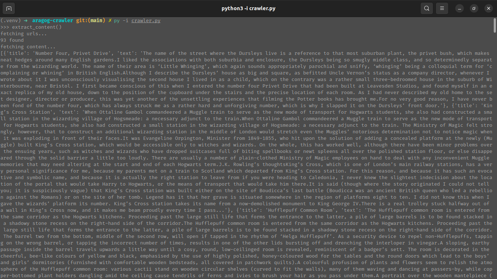

# aragog-crawler
Python web scraper for the wizardingworld.com website

# Features
Scraps content from each of J.K. Rowling original writings from https://www.wizardingworld.com/writing-by-jk-rowling

# Usage
## Install Dependencies
`python -m pip install -r requirements.txt`

Then simply call the crawl() method from crawler.py and it will return a list of dictionaries containing the 'title' and 'text' for each of the writings.

# Known Problems
When the https://www.wizardingworld.com/writing-by-jk-rowling/ page is first rendered it doesn't load all of the necessary urls, but does so as the page is scrolled down.
Selenium is being implemented to automate that behavior.

# Reference
[Beautiful Soup](https://www.crummy.com/software/BeautifulSoup/bs4/doc/)  
[Real Python](https://realpython.com/beautiful-soup-web-scraper-python/)  
[Wizarding World Website](https://www.wizardingworld.com/)

I don't own any of the content scraped. This project is for educational purposes only.
