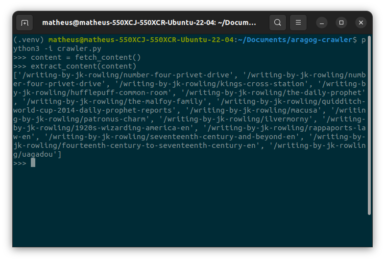

# aragog-crawler
python web scraper for the wizardingworld.com website (in development)

# Current features
scrapes for urls of j.k. rowling originals

# Planned Features
the final goal is to build a database with data from all of the [j.k. rowling originals](https://www.wizardingworld.com/writing-by-jk-rowling) collection

# Reference
[Beautiful Soup](https://www.crummy.com/software/BeautifulSoup/bs4/doc/)  
[Real Python](https://realpython.com/beautiful-soup-web-scraper-python/)
